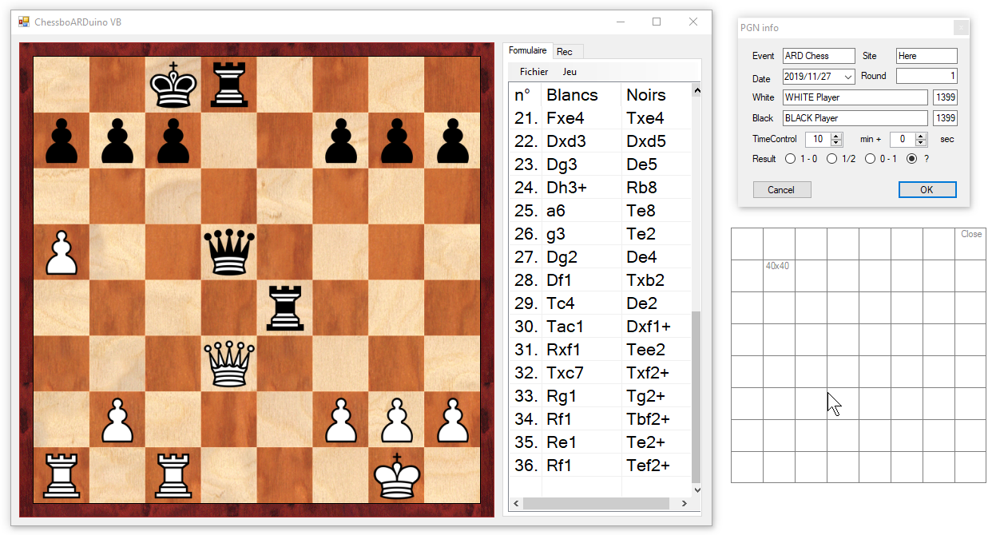

# LedChessBoard
VB10 LED chessBoard

 

Pilotage d'un échiquier arduino avec ILS et LED  pour jouer sur lichess

version de mon prog qui fait le job  
MAIS plein de BUG  

a remplacer a terme par un BOT lichess  

